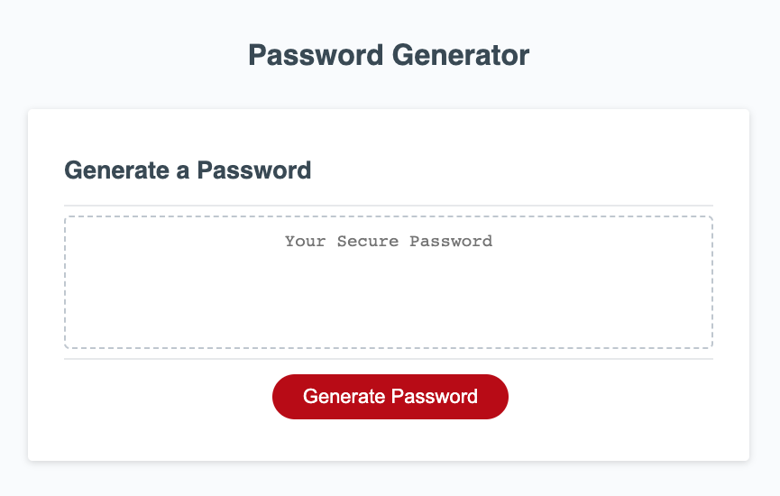
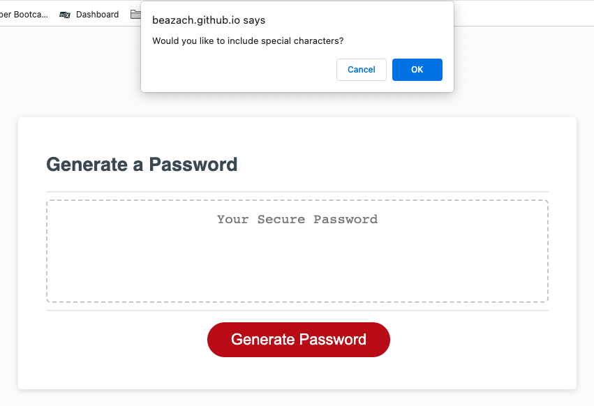
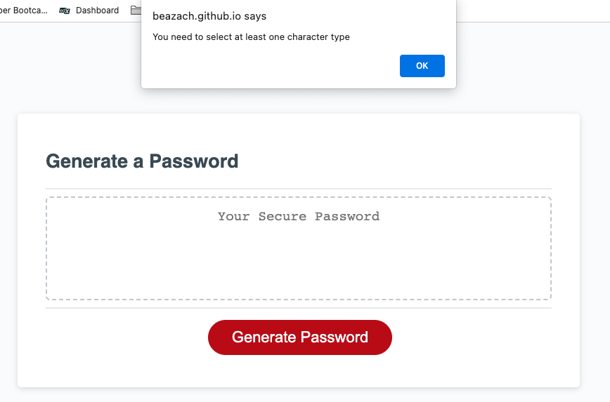
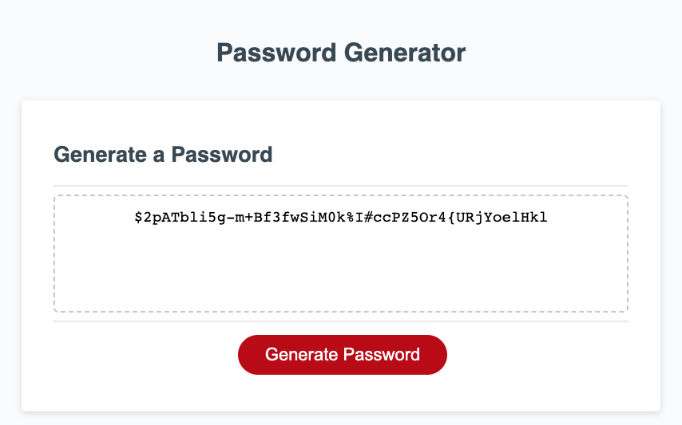

# password-generator
Deployed link: https://beazach.github.io/password-generator/

## Description 
In this project I was tasked with creating an application that an employee can use to generate a random password meeting a set of criteria:  
- At least 10 characters but no more than 64
- At least one character type should be selected (i.e. lowercase, uppercase, numeric, special character)

Code should validate for each input and once all prompts are answered, the password should be generated and displayed in an alert or written to the page.

## Usage
Application appearance:

Example of a prompt:

Example of an alert when selection criteria are not met:

Generated password:

## Contact Details
Please leave a note or get in touch about suggestions for code improvements, future projects and collaborations.

## License 
MIT

## Resources 
- https://courses.bootcampspot.com/courses/3029/pages/5-module-5-intermediate-javascript?module_item_id=853108 (accessed 16 January 2023)
- https://fantastic-pudding.vercel.app/ (accessed 16 January 2023)